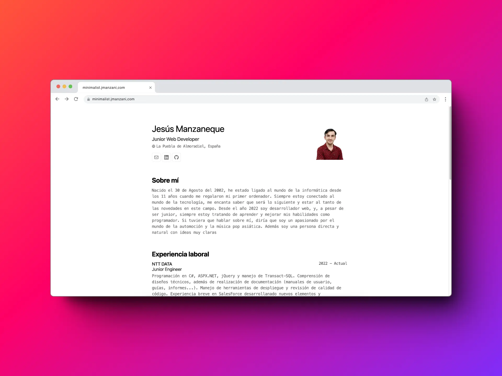

# Minimalist portfolio

Este es mi proyecto de portfolio minimalista inspirado en el de Midudev.

## Descripción

Este proyecto es un portfolio web diseñado para mostrar mis habilidades, proyectos y experiencia de una manera limpia y minimalista.

## Características

- Diseño minimalista y elegante.
- Secciones para mostrar proyectos destacados, habilidades, experiencia y contacto.
- Responsive design para una experiencia óptima en dispositivos móviles y de escritorio.

## Capturas de pantalla

## Instalación y Uso

1. Clona este repositorio: `git clone https://github.com/jmanzani/minimalist-portfolio.git`
2. Haz `pnpm run dev`

## Tecnologías utilizadas

- Astro
- Tailwind

## Licencia

Este proyecto está bajo la licencia MIT. Para más detalles, consulta el archivo `LICENSE`.

## Contacto

- Email: contacto@jmanzani.com
